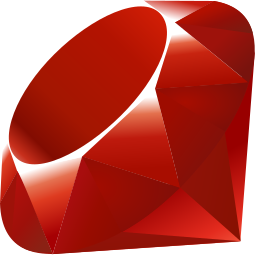

<h1 align="center">Hi 👋, I'm Jordan Siemens</h1>
<h3 align="center">My name is Jordan Siemens and I'm a Fullstack web developer based in Berlin. I am from Canada and have a diverse professional and educational background in the arts, businesses and most recently web development.</h3>

:man_student:	 I'm a recent graduate from [Le Wagon's](https://www.lewagon.com/) fullstack web development bootcamp

:computer: My experience is in Ruby, Ruby on Rails, HTML, CSS, Bootstrap, JavaScript, jQuery, SQL, git, GitHub, and Heroku

  
  
  
  
  
  
  
  

 

🌱 I’m currently developing my coding skills and working on personal projects to forge them

🤔 I’m incredibly curious and always love a good challenge

### Some recent projects I've built

:construction: [HandyBee](https://www.handybee.me/) - A digital network to search for local handy people to help with your home improvements. Built on Ruby in Rails.

:bike: [Bikey Bee](https://airbnb-jordannadroj.herokuapp.com/) - A marketplace for renting out Bicycles. Built on Ruby on Rails

:cocktail: [Mister Cocktail](https://rails-mister-cocktail-470.herokuapp.com/) - A cocktail library anyone can conribute to. Built on Ruby on Rails

### Get In Touch

📫 jordansiemens93@gmail.com

:link: [My LinkedIn](https://www.linkedin.com/in/jordan-siemens/)

